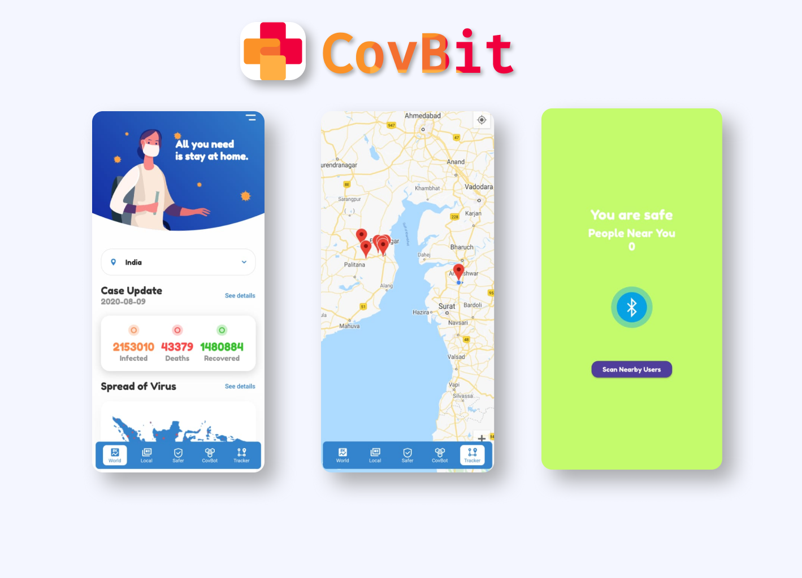
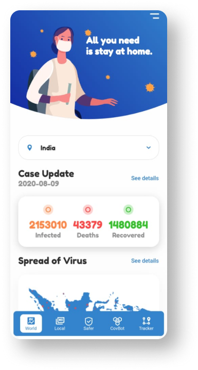
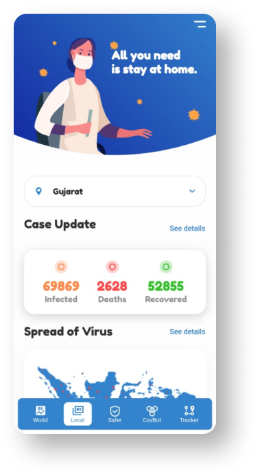
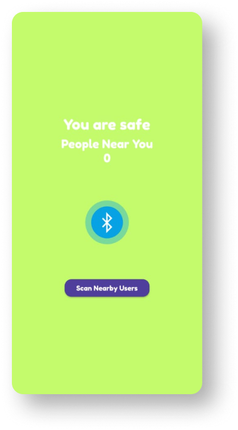
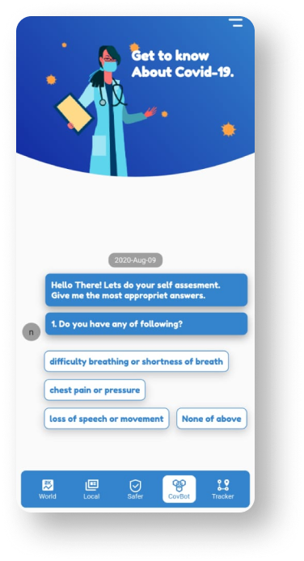
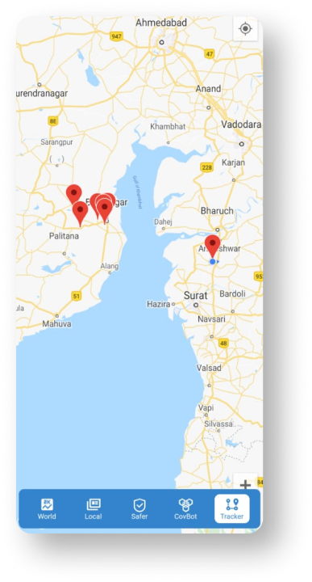

Hello Community 👋:

  
</img>

# 💡**Project Description**💡::

-   CovBit is an Mobile📱 application that is helpful🙌 to get in touch with the current scenario of Covid-19🦠 cases all over the world🌐 as well as India and also brief state-wise information.
-   CovBit is also helpful to maintain social distancing. 
-   CovBit is also available to predict if the patient is COVID🦠 positive or not by just the help of uploaded images of the X-Ray📋.
-   CovBit has a chat box which is helpful for common doubts.
-   CovBit is also aware us by providing the real-time location of Covid-19🦠 positive users.
-  Give a try to [CovBit-apk](https://drive.google.com/file/d/1h2IKGniDqVr_NPPDXt3cnknNf93NOmn6/view?usp=drivesdk)
> Winner at Yuva Hackathon Bhavnagar Chapter. 
> Top 15/437 at [Hack Against Covid(HAC-202)](https://hac.codezoned.com/) 
> [link](https://github.com/HAC-2020/Monks) for repo at HAC-2020

# 💁‍♂️**Features**💁‍♀️::

## **1.Current status of COVID-19🦠**:✔️

-   To get updated with the current situation of the COVID-19🦠, we have created a dashboard📈 that gives us real-time data🗂️.
  
**At World Tab**:Realtime data🗂️ of any country related to Covid-19🦠 cases are available.

**At Local Tab**: Realtime data🗂️ of every state of India related Covid-19🦠 cases.
<table>
  <tr>
    <td></td>
    <td></td> 
  </tr>
  </table>

## **2.Social Distancing Module**📏:✔️

Social distancing plays important role in the time of this pandemic. So social distancing is most important to stop🛑 the spread of COVID-19. That’s why we come up with one solution which takes care of the social distancing. If Bluetooth permission is granted in the app then it also makes us aware of social distancing. It gives us a warning⚠️ if we get too close to another person. But to get the advantage of this feature both people should have CovBit.

 
</img>

## **3.Self Assessmaent Chatbot**🤖:

Many people get panicked in the thinking of small issues related to their health, and this small illness doesn’t require the assessment of doctors👨🏼‍⚕️.
So that we have created the chat bot which shows that if the person needs any medical💊 attention🩺 or not and makes us aware. This chat bot helps people to come out of panic situations and depression.

</img>

## **4.COVID-19🦠 positive user tracker**:✔️

The location of the COVID infected😷 person is the most important to put the focus on. If we are aware of the location of COVID infected than we can take precautions🩸. So that we have given the facility to get the location of COVID infected person.

 
</img>

## **5.Detection of COVID-19 using x-ray📋**:

Health organizations are facing a shortage of testing kits to test patients🤒. So, we have found another solution to detect whether the patient is COVID positive or not. We have implemented AI which detects the COVID-19 status by the image of X-Rays.

# **Limitation of our CovBit application😞**::

-	We are currently working on X-Ray image predictor AI. We need to integrate this model into CovBit.
- Currently CovBit shows only total numbers of positive, recoverd and death in any particular country or Indian state
  we can fetch more data from APIs and can visualize that data in form of graphs so user can know more about
  current situation.
-	Because of limited users, we haven’t provided the real-time location of COVID-19 positive patient. 

